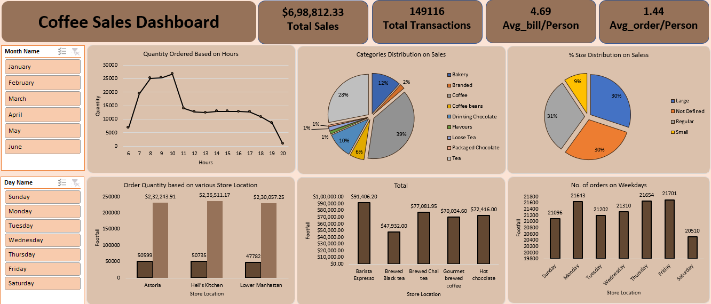

# Coffee Shop Sales Analysis

**Project Date:** October 2024  
**Technologies Used:** Excel

This project involves analyzing coffee shop sales data. The data was obtained from a free dataset website and loaded into Excel. I cleaned the data, created new columns for analysis, and built a dashboard to visualize sales performance and trends.

## Key Highlights
- Cleaned and transformed raw sales data in Excel.
- Created new calculated columns for deeper insights (e.g., profit margins, average sales).
- Developed an interactive Excel dashboard to visualize trends and sales performance.

## Project Walkthrough
1. **Data Loading**: Imported data from a free dataset website.
2. **Data Cleaning**: Cleaned missing or erroneous values and created new columns for analysis.
3. **Dashboard Creation**: Developed a comprehensive dashboard to visualize sales trends.

## Screenshots (If applicable)

